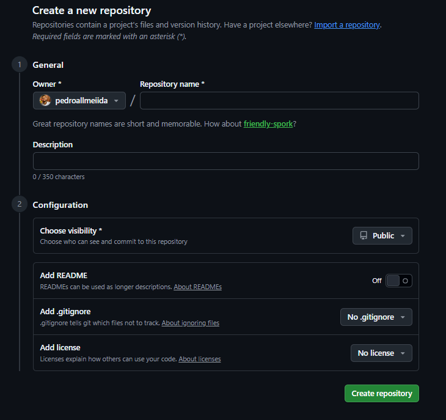
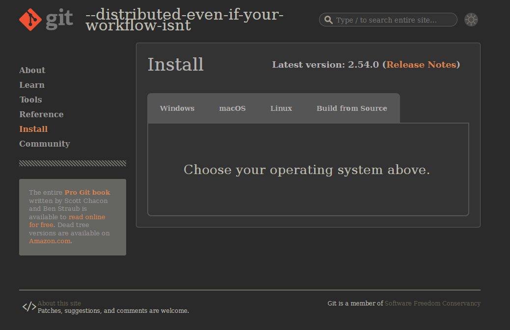
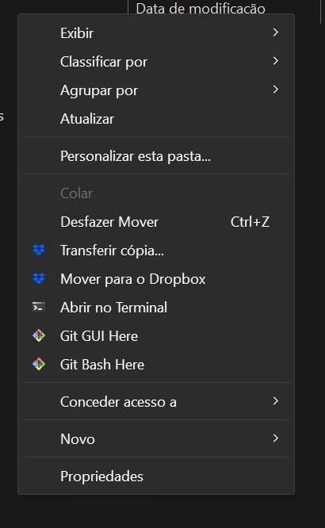
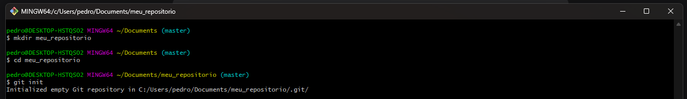
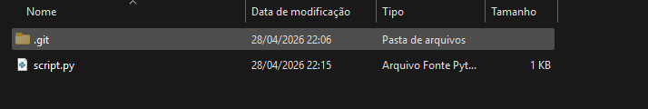

#  Introdução ao github

## Objetivo da Aula

</br>

- Entender o que é Git e GitHub
- Criar conta e repositório
- Versionar arquivos
- Enviar código para o GitHub

---

## O que é Git?

</br>

</br>

:::: {.columns}

::: {.column width="40%"}

::: {style="background: rgba(78, 93, 181, 0.1); backdrop-filter: blur(10px); border-radius: 10px; padding: 10px; border: 1px solid rgba(100, 87, 108, 0.3);"}
O <mark style="background: #aeddfe; 
  padding: 0 5px; 
  border-radius: 8px;
  font-weight: 500;"> Git</mark> é um sistema de 
<mark style="background: #ffeaa7; 
  padding: 0 5px; 
  border-radius: 8px;
  font-weight: 500;">controle de versão</mark>. que acompanha as alterações nos arquivos de forma inteligente. 

O Git é particularmente útil quando você e um grupo de pessoas fazem alterações nos mesmos arquivos ao mesmo tempo.
:::

:::

::: {.column width="60%"}

{width="100%" height="auto"}


:::

::::


## O que podemos fazer com o Git

</br>

<div style="display: grid; grid-template-columns: repeat(3, 1fr); gap: 20px; margin-top: 30px;">

<div style="background: linear-gradient(135deg, #667eea 0%, #764ba2 100%); 
  padding: 25px; 
  border-radius: 15px; 
  color: white;
  box-shadow: 0 10px 20px rgba(0,0,0,0.1);text-align: center;">
  <div style="font-size: 2.5em; margin-bottom: 15px;">📦</div>
  <div style="font-size: 1.2em; font-weight: 600;">Controle de Versão</div>
  <div style="font-size: 0.9em; opacity: 0.9; margin-top: 10px;">Gerencie diferentes versões da sua aplicação</div>
</div>

<div style="background: linear-gradient(135deg, #f093fb 0%, #f5576c 100%); 
  padding: 25px; 
  border-radius: 15px; 
  color: white;
  box-shadow: 0 10px 20px rgba(0,0,0,0.1);text-align: center;">
  <div style="font-size: 2.5em; margin-bottom: 15px;">🔍</div>
  <div style="font-size: 1.2em; font-weight: 600;">Rastrear Mudanças</div>
  <div style="font-size: 0.9em; opacity: 0.9; margin-top: 10px;">Acompanhe cada alteração no código</div>
</div>

<div style="background: linear-gradient(135deg, #4facfe 0%, #00f2fe 100%); 
  padding: 25px; 
  border-radius: 15px; 
  color: white;
  box-shadow: 0 10px 20px rgba(0,0,0,0.1);text-align: center;">
  <div style="font-size: 2.5em; margin-bottom: 15px;">📜</div>
  <div style="font-size: 1.2em; font-weight: 600;">Histórico Completo</div>
  <div style="font-size: 0.9em; opacity: 0.9; margin-top: 10px;">Mantenha todo o histórico de versões</div>
</div>

</div>


## O que é GitHub?


</br>

</br>

:::: {.columns}

::: {.column width="40%"}

::: {style="background: rgba(78, 93, 181, 0.1); backdrop-filter: blur(10px); border-radius: 10px; padding: 10px; border: 1px solid rgba(100, 87, 108, 0.3);"}
O <mark style="background: #aeddfe; 
  padding: 0 5px; 
  border-radius: 8px;
  font-weight: 500;"> GitHub</mark> é uma plataforma baseada em nuvem em que é possível armazenar, 
  compartilhar e trabalhar com outras pessoas para escrever códigos
:::

:::

::: {.column width="60%"}

{width="100%" height="auto"}


:::

::::

## O que é possível fazer com repositórios no GitHub

</br>

<div style="display: grid; grid-template-columns: repeat(3, 1fr); gap: 25px; margin-top: 30px;">

<div style="background: linear-gradient(135deg, #667eea 0%, #764ba2 100%); 
  padding: 30px 20px; border-radius: 20px; color: white; text-align: center;
  box-shadow: 0 15px 30px rgba(0,0,0,0.1); transition: transform 0.3s;">
  <div style="font-size: 3em; margin-bottom: 20px;">🎯</div>
  <div style="font-size: 1.2em; font-weight: 700; margin-bottom: 15px;">Compartilhar</div>
  <div style="font-size: 0.9em; opacity: 0.95;">Demonstrar ou compartilhar seu trabalho</div>
</div>

<div style="background: linear-gradient(135deg, #f093fb 0%, #f5576c 100%); 
  padding: 30px 20px; border-radius: 20px; color: white; text-align: center;
  box-shadow: 0 15px 30px rgba(0,0,0,0.1); transition: transform 0.3s;">
  <div style="font-size: 3em; margin-bottom: 20px;">📊</div>
  <div style="font-size: 1.2em; font-weight: 700; margin-bottom: 15px;">Gerenciar</div>
  <div style="font-size: 0.9em; opacity: 0.95;">Acompanhar e gerenciar alterações no código</div>
</div>

<div style="background: linear-gradient(135deg, #4facfe 0%, #00f2fe 100%); 
  padding: 30px 20px; border-radius: 20px; color: white; text-align: center;
  box-shadow: 0 15px 30px rgba(0,0,0,0.1); transition: transform 0.3s;">
  <div style="font-size: 3em; margin-bottom: 20px;">🤝</div>
  <div style="font-size: 1.2em; font-weight: 700; margin-bottom: 15px;">Colaborar</div>
  <div style="font-size: 0.9em; opacity: 0.95;">Revisão de código e sugestões de melhoria</div>
</div>

</div>


---

## Git vs GitHub vs GitLab

```{=html}
<div style="display: grid; grid-template-columns: repeat(3, 1fr); gap: 25px; margin-top: 30px;">

<div style="background: #f7f8fa; border-radius: 16px; padding: 25px; text-align: center; border: 1px solid #e1e4e8;">
  
  <div style="font-size: 0.85em; color: #666; margin-bottom: 20px;">Sistema de Controle de Versão</div>
  <div style="border-top: 1px solid #e1e4e8; padding-top: 15px; text-align: left; font-size: 0.85em; color: #444;">
    <div style="margin: 8px 0;"> - Ferramenta local</div>
    <div style="margin: 8px 0;">- Funciona offline</div>
    <div style="margin: 8px 0;"> - Linha de comando</div>
  </div>
</div>

<div style="background: #f7f8fa; border-radius: 16px; padding: 25px; text-align: center; border: 1px solid #e1e4e8;">
  
  <div style="font-size: 0.85em; color: #666; margin-bottom: 20px;">Plataforma de Hospedagem</div>
  <div style="border-top: 1px solid #e1e4e8; padding-top: 15px; text-align: left; font-size: 0.85em; color: #444;">
    <div style="margin: 8px 0;"> - Repositórios remotos</div>
    <div style="margin: 8px 0;"> - Colaboração em equipe</div>
    <div style="margin: 8px 0;"> - Interface web</div>
    <div style="margin: 8px 0;"> - GitHub Actions (CI/CD nativo)</div>
  </div>
</div>

<div style="background: #f7f8fa; border-radius: 16px; padding: 25px; text-align: center; border: 1px solid #e1e4e8;">
  
  <div style="font-size: 0.85em; color: #666; margin-bottom: 20px;">Plataforma DevOps</div>
  <div style="border-top: 1px solid #e1e4e8; padding-top: 15px; text-align: left; font-size: 0.85em; color: #444;">
    <div style="margin: 8px 0;"> - CI/CD integrado</div>
    <div style="margin: 8px 0;"> - Self-hosted opcional</div>
    <div style="margin: 8px 0;"> - Pipeline completo</div>
  </div>
</div>

</div>
```


## Criando uma conta

</br>

</br>


<div style="display: flex; gap: 40px; align-items: center; margin: 30px 0;">

<div style="display: flex; align-items: baseline; margin-bottom: 20px;">
  <div style="background: #0969da; color: white; width: 28px; height: 28px; border-radius: 50%; display: inline-flex; align-items: center; justify-content: center; font-size: 0.8em; font-weight: 600; margin-right: 15px;">1</div>
  <div> Acesse [github.com](https:www.github.com) </div>
</div>

<div style="display: flex; align-items: baseline; margin-bottom: 20px;">
  <div style="background: #0969da; color: white; width: 28px; height: 28px; border-radius: 50%; display: inline-flex; align-items: center; justify-content: center; font-size: 0.8em; font-weight: 600; margin-right: 15px;">2</div>
  <div>Clique em <strong> Criar uma conta (Sign up)</strong></div>
</div>

<div style="display: flex; align-items: baseline; margin-bottom: 20px;">
  <div style="background: #0969da; color: white; width: 28px; height: 28px; border-radius: 50%; display: inline-flex; align-items: center; justify-content: center; font-size: 0.8em; font-weight: 600; margin-right: 15px;">3</div>
  <div>Preencha o cadastro: <strong>usuário, e-mail e senha</strong></div>
</div>

</div>


{width=100%}


## Criando um repositório

</br>

:::: {.columns}

::: {.column width="40%"}

</br>

</br>


::: {style="font-size: 0.75em;"}
- Defina o nome do repositório (evitar acentuação e caracteres especiais)
- Descrever o seu projeto 
- visibilidade pública 
- add README (aqui detalhamos o conteúdo do nosso projeto)
- definir licenças de uso
:::
:::

::: {.column width="60%"}

{width=500}


:::

::::


---

## Instalando o Git


Primeiro passo é baixar o git na sua máquina. Baixar em: [git-scm.com](https:www.git-scm.com)


{width=500}


## Configuração inicial


::: {.columns}

::: {.column width="40%"}

{width=80%}

:::

::: {.column width="60%"}

::: {style="font-size: 0.75em;"}

:::

</br>

</br>


Depois de instalar o git na sua máquina, utilize o *"Git Bash Here"* para configurar o seu usuário no Git. 


</br>

#### Configuração: 


```bash
git config --global user.name "Seu Nome"
git config --global user.email "seu@email.com"
```

:::

::::


---

## Criando projeto diretório local

</br>

</br>

Para criar um novo repositório na sua máquina local. Na pasta onde você quer criar: clique no botão direito do mouse, entre no Git Bash Here e digite: 

</br>


```bash
mkdir meu_repositorio
cd meu_repositorio
git init
```

</br>

Exemplo:

{width=80%}

## Criando arquivo 

</br>


Também no Git Bash Here, digite: 

</br>


```bash
echo "print('Hello GitHub')" > script.py
```

</br>


Arquivo criado na pasta:

{width=80%}

---

## Primeiro commit da sua vida 

</br>

Primeiro adicionamos o arquivo e depois fazemos o commit (o registro das alterações feitas nos arquivos, com uma mensagem descritiva.)

</br>


```bash
git add script.py
git commit -m "primeiro commit"
```


</br>

---

### Principais comandos Git para atualizar o GitHub

</br>

##### Conectando ao GitHub

```bash
git remote add origin https://github.com/usuario/repo-github.git
git branch -M main
git push -u origin main
```


##### Atualizações

```bash
git add .
git commit -m "atualização"
git push
```


##### Fluxo para Atualizar o repositório local 

```bash
git pull
git add .
git commit -m "mensagem"
git push
```


##### Clonando repositório

```bash
git clone URL
```

---


## O que é uma Branch?

</br>


Uma **branch** é uma linha independente de desenvolvimento dentro de um repositório Git:

* Permite desenvolver funcionalidades sem afetar o código principal
* Facilita testes e correções
* Muito utilizada em trabalho colaborativo

</br>


**Pense que a Branch seria como uma “linha paralela” do projeto**

---

## Por que usar Branches?

</br>


* Evita quebrar o código principal (**main** ou **master**)
* Permite múltiplas pessoas trabalhando ao mesmo tempo
* Organiza melhor o desenvolvimento

</br>

#### Exemplos de organização de Branches:

* `main` → versão estável
* `develop` → desenvolvimento
* `feature-x` → nova funcionalidade

---

## Verificando Branches

</br>


Para listar as branches existentes, basta usar o seguinte comando:

</br>


```bash
git branch
```
</br>


**OBS:** A branch atual aparece com `*`

---

## Como Mudar de Branch

</br>

#### Forma tradicional:

</br>


```bash
git checkout nome-da-branch
```

</br>


#### Forma mais moderna:

</br>


```bash
git switch nome-da-branch
```

</br>

OBS: Ambas chegam no mesmo resultado. Porém a switch foi criada para versões mais atuais para usar exclusivamente para branches. 

---

## Criando uma Nova Branch

</br>


Criar e já mudar para ela:


</br>


```bash
git switch -c nova-branch
```

ou:

```bash
git checkout -b nova-branch
```


---

## Boas Práticas para usos da Branch

</br>

* Sempre verifique a branch atual
* Evite trabalhar direto na `main`
* Use nomes claros:

  * `feature/login`
  * `bugfix/erro-api`

---

## Merge entre branch

- O merge é o processo de unir alterações de uma branch em outra.

- Para que serve?
  - Integrar novas funcionalidades
  - Atualizar a branch principal (main ou develop)
  - Consolidar o trabalho da equipe

## Como fazer um merge

</br>

Vá para a branch que vai receber as mudanças:

```bash
git switch main
```

</br>

Execute o merge:

```bash
git merge nome-da-branch ('branch' que você quer passar)
```

## Atividade prática

</br>

- Criar o repositório da disciplina
- Crie outra Branch
- Subir um arquivo 
- Criar README

