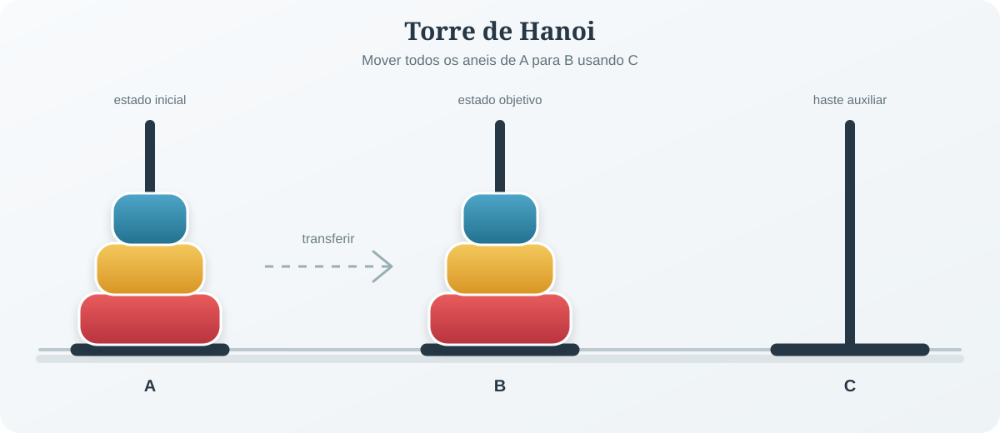

---

### Algoritmos 

<br/>

- Um algoritmo é um processo sistemático para a resolução de um problema. O desenvolvimento de algoritmos é
particularmente importante para problemas a serem solucionados em um computador, pela própria natureza do
instrumento utilizado.

<br/>

- um algoritmo representa um conjunto de regras para solução de um problema. Essa é uma definição geral, podendo ser aplicada a qualquer circunstância que exija a descrição da solução. 

---

### Exemplo: Receita de Bolo

<br/>

Receita de bolo é um exemplo de algoritmo, pois descreve as regras para o seu preparo, como a sequência da inclusão dos ingredientes para bater as gemas, o cozimento e assim por diante. 

**Obs:** Note que, se as instruções tiverem sua ordem trocada ou a quantidade dos ingredientes alterada, o resultado vai divergir do original. 


Dessa forma, em programação, o algoritmo especifica com clareza e de forma correta as instruções que um software everá conter para que, ao ser executado, forneça os resultados esperados. 


--- 

#### Problema da Torre de Hanoi


{fig-align="center" width="100%"}


A proposição do problema é a seguinte: Inicialmente têm-se três hastes, A,B e C e na haste A repousam três  anéis de diâmetros diferentes, em ordem decrescente por diâmetro.O objetivo é transferir os três anéis da haste A para B, usando C se necessário. As regras são : 

- deve-se mover um único anel por vez
- um anel de diâmetro maior nunca pode repousar sobre algum outro diâmetro menor. 


---

### Exercício: Construa um algoritmo para resolver o problema das torres de Hanoi 


---

### Algoritmos para Torres de Hanoi

<br/>

#### Forma 1: 

1. Mover um anel da Haste **A** para **B**
2. Mover um anel da Haste **A** para **C**
3. Mover um anel da Haste **B** para **C**
4. Mover um anel da Haste **A** para **B**
5. Mover um anel da Haste **C** para **A**
6. Mover um anel da Haste **C** para **B**
7. Mover um anel da Haste **A** para **B**

--- 

#### Forma 2: 

1. Mover um anel da Haste **A** para **C**
2. Mover um anel da Haste **A** para **B**
3. Mover um anel da Haste **C** para **B**
4. Mover um anel da Haste **A** para **C**
5. Mover um anel da Haste **B** para **C**
6. Mover um anel da Haste **B** para **A**
7. Mover um anel da Haste **C** para **A**
8. Mover um anel da Haste **C** para **B**
9. Mover um anel da Haste **A** para **C**
10. Mover um anel da Haste **A** para **B**
11. Mover um anel da Haste **C** para **B**

---

<br/>

<br/>

<br/>

Portanto, note que existem dois algoritmos para resolver um mesmo problema. Além disso, um algoritmo pode ser melhor que outro de acordo com alguma métrica. Nesse exemplo, o número de passos para resolver o problema seria nossa métrica. 

---

#### Caso geral da Torre de Hanoi


Para `n` anéis, o menor número de movimentos necessários é dado por:

$$M(n) = 2^n - 1$$

| `n` | Número de movimentos | Movimentos resumidos |
|-:|-:|:--------|
| 3 | 7 | A -> B; A -> C; B -> C; A -> B; C -> A; C -> B; A -> B |
| 4 | 15 | A -> C; A -> B; C -> B; A -> C; B -> A; B -> C; A -> C; A -> B; C -> B; C -> A; B -> A; C -> B; A -> C; A -> B; C -> B |
| 5 | 31 | A -> B; A -> C; B -> C; A -> B; C -> A; C -> B; A -> B; A -> C; B -> C; B -> A; C -> A; B -> C; A -> B; A -> C; B -> C; A -> B; C -> A; C -> B; A -> B; C -> A; B -> C; B -> A; C -> A; C -> B; A -> B; A -> C; B -> C; A -> B; C -> A; C -> B; A -> B |

--- 

### Formalização de um algoritmo

<br/>


A tarefa de especificar os algoritmos para representar um programa consiste em detalhar os dados que serão processados pelo programa e as instruções que vão operar sobre esses dados.

<br/>


Em primeiro lugar, é necessário definir um conjunto de regras que regulem a escrita do algoritmo, isto é, regras de **sintaxe**. Em segundo, é preciso estabelecer as regras que permitam interpretar um algoritmo, que são as regras **semânticas**.  

---

### Sintaxe e semântica

<br/>


- **Sintaxe:** conjunto de regras que define como o algoritmo deve ser escrito.
  Ela determina a ordem das instruções, a forma de declarar variáveis e os
  símbolos que podem ser utilizados.

- **Semântica:** significado de cada instrução do algoritmo. Ela determina o que
  deve acontecer quando uma instrução é executada.

Por exemplo, `media <- (nota1 + nota2 + nota3) / 3` possui uma sintaxe válida
quando a linguagem permite atribuição com `<-`. Semanticamente, essa instrução
calcula a média das três notas e armazena o resultado na variável `media`.

---

### Exemplo: cálculo da média de três notas

<br/>

<br/>


```text
Algoritmo em Portugol "calculo_da_media"
Var
   nota1, nota2, nota3, media: real
Inicio
   leia(nota1)
   leia(nota2)
   leia(nota3)
   media <- (nota1 + nota2 + nota3) / 3
   escreva(media)
FimAlgoritmo
```

---

#### Interpretação semântica

<br/>


1. As variáveis `nota1`, `nota2` e `nota3` armazenam os dados de entrada.
2. A instrução `leia` recebe os valores fornecidos pelo usuário.
3. A expressão `(nota1 + nota2 + nota3) / 3` calcula a média aritmética.
4. A instrução `escreva` apresenta o resultado na tela.

Nesse exemplo, a sintaxe organiza a escrita do algoritmo, enquanto a semântica
explica o efeito de cada instrução e o resultado produzido.

