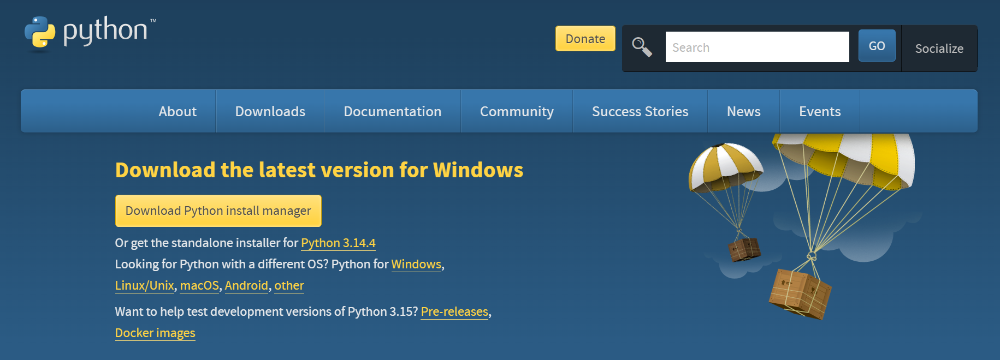
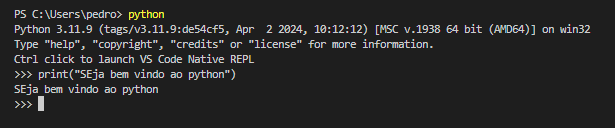

# Introdução a Linguagem Python


---

### Python

</br>


:::: {.columns}

::: {.column width="60%"}

- O Python é uma linguagem de programação gratuita e de código aberto, projetada para ser acessível e funcional. 

- Diferentemente de linguagens compiladas como Java ou C++, Python é interpretada, ou seja, seu código é executado diretamente, sem a necessidade de compilação. 

- Possue uma sintaxe clara e legível. 


Livro Gratuito: [https://wesmckinney.com/book/](https://wesmckinney.com/book/)

:::


::: {.column width="40%"}

</br>

{width="60%" height="auto"}

:::

::::


---

### Por que usar o Python para análise de dados 

</br>

- Desde seu surgimento em 1991, Python se tornou uma das linguagens de programação interpretadas mais populares, juntamente com Perl, Ruby e outras. 


- Python e Ruby se tornaram especialmente populares a partir de 2005, aproximadamente, para a construção de websites utilizando seus inúmeros frameworks web, como Rails (Ruby) e Django (Python).


- Nos últimos 20 anos, Python passou a ser uma das linguagens mais importantes para ciência de dados, aprendizado de máquina e desenvolvimento de software em geral, tanto na academia quanto na indústria.

---

### Outras linguagens para dados

</br>

Para análise de dados, computação interativa e visualização de dados, o Python inevitavelmente será comparado a outras linguagens e ferramentas de programação comerciais e de código aberto amplamente utilizadas, como R, Julia, MATLAB, SAS, Stata e outras. 

---

### Vantagens do Python

</br>

- Comunidade Forte: Possui uma das maiores comunidades em linguagem de programação. Bastante ativa. 

- Robustez geral do Python para engenharia de software de propósito geral, ele se torna uma excelente opção como linguagem principal para o desenvolvimento de aplicações de dados. 

- Consegue integrar bem Análise de dados e desenvolvimento de Softwares  

- Bibliotecas/Pacotes bem fundamentados para construção de modelos de ML e IA 

## Instalação do Python 

</br>

Acesse o [https://www.python.org/downloads/](https://www.python.org/downloads/)

{width="60%" height="auto"}


## Histórico das versões Python 

</br>

{width="90%" height="auto"}


# Bibliotecas Essenciais do Python

---

### Instalando uma biblioteca em Python 

</br>

- No python, use **pip install nome-pacote** . 

- Se tiver no jupyter notebook use **!pip install nome-pacote**. 

--- 

### Principais Bibliotecas

</br>

- numpy: manipulação e operações númericas
- pandas: Manipulação de dados
- scipy: Inclui módulos para estatística, otimização, integração, álgebra linear, transformadas de Fourier, processamento de sinais e imagem
- scikit-learn: principal biblioteca de algoritmos de ML
- statsmodels: modelos estatísticos
- matplotlib: visualização de dados
- seaborn: Visualização de dados
- plotnine: Visualização de dados usando ggplot2 do R  
- tensorFlow: Treinamento de algortmos de ML (Redes Neurais)
- pyTorch: Treinamento de algortmos de ML  (Redes Neurais)


--- 

### Convenções de Importação

</br>

A comunidade Python adotou diversas convenções de nomenclatura para módulos de uso comum:

</br>

```Bash
## Importando as bibliotecas no python
import numpy as np
import matplotlib.pyplot as plt
import pandas as pd
import seaborn as sns
import statsmodels as sm


## Configuracao de saidas usando pandas 

pd.options.display.max_columns = 20
pd.options.display.max_rows = 20
pd.options.display.max_colwidth = 80
np.set_printoptions(precision=4, suppress=True)

```

--- 


## interpretador Python

</br>

- Python é uma linguagem interpretada. 

- O interpretador Python executa um programa executando uma instrução por vez. 

- O interpretador Python interativo padrão pode ser invocado na linha de comando. 


{width="60%" height="auto"}

---


