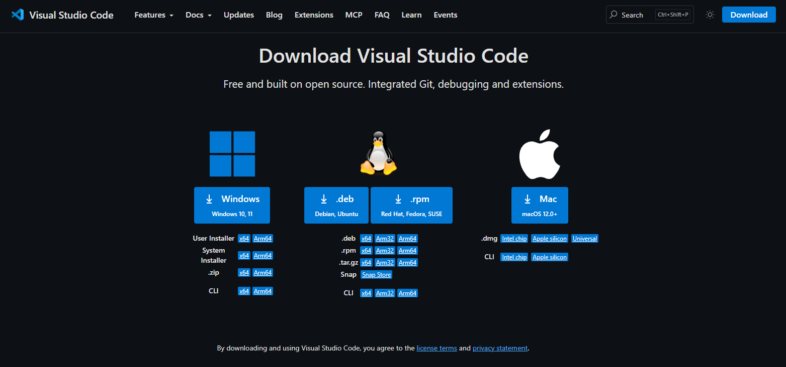
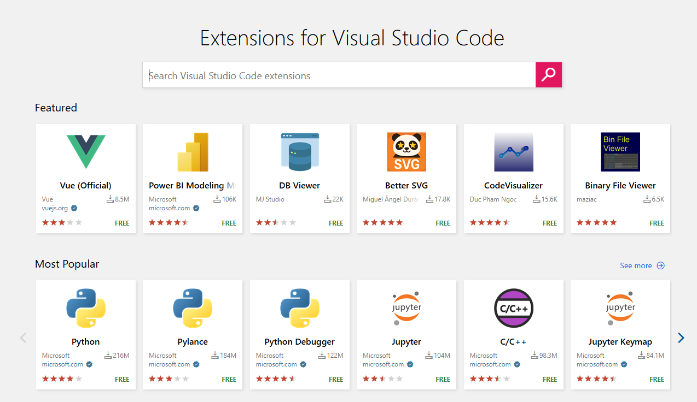

Esse é um tutorial introdutório para configuração do VS Code. 

##  Baixar o VS Code diretamente do site oficial:

Acesse: [https://code.visualstudio.com/download](https://code.visualstudio.com/download)

{width="85%" height="auto"}

## Extensões do VS Code 

Aqui encontramos as principais extensões para usar no VS Code.  

Acesse: [https://marketplace.visualstudio.com/VSCode](https://marketplace.visualstudio.com/VSCode)

{width="85%" height="auto"}

### As principais Extensões 

1. **jupyter:** Para criar os nossos Jupyer notebooks 

2. **Python:** Você pode instalar o Python através das extensões.Para versões mais atuais, use o proprio site do Python. 

3. **R:** Também podemos instalar o R nas extensões 

4. **Quarto:** Para criar relatórios iterativos, apresentações e dashboards 

5. **GitHub Copilot:** Assistente de códigos 

6. **Continue:** Assistente de códigos, porém é open Source. 

7. **HTML CSS Support:** Automatizar a construção de arquivos .css (que configura o estilo visual do relatorio em markdown)  

8. **Markdown Board:** Criar o planejamento das atividades (Kanban)

9. **Trello Kanban Board:** Também ajuda no planejamento de atividades 